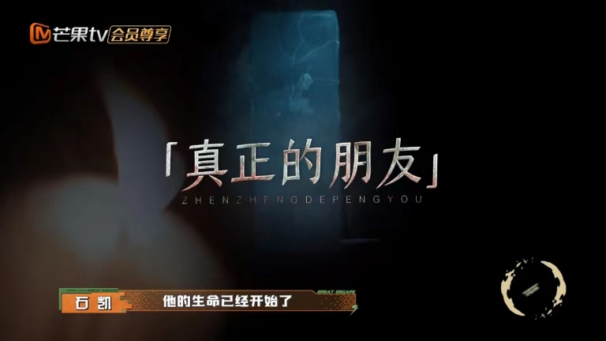
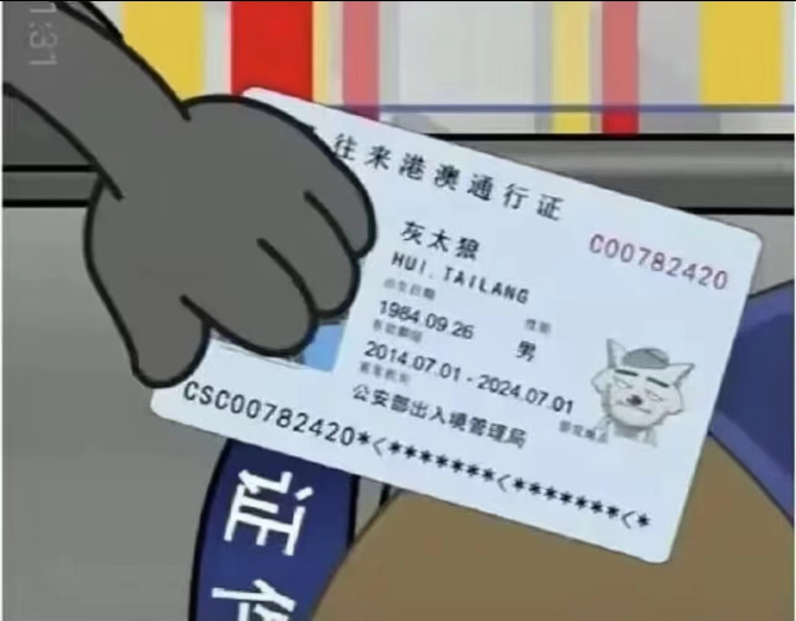

# *我的笔记和模型（这是第一级标题）*

## **这是第二级标题**

### ___这是第三级标题___

**How to be a good programmer ?**

- *The frist step is* to learn the basic knowledge of the language .
  
- 你好
  

+  *The second step is* to practice the basic knowledge of the syntax .

**The third step is* to enjoy it !

1. The frist letter of ONE is O .

2. The second letter of ONE is N .

3. The third letter of ONE is E .

##这是我的模型

